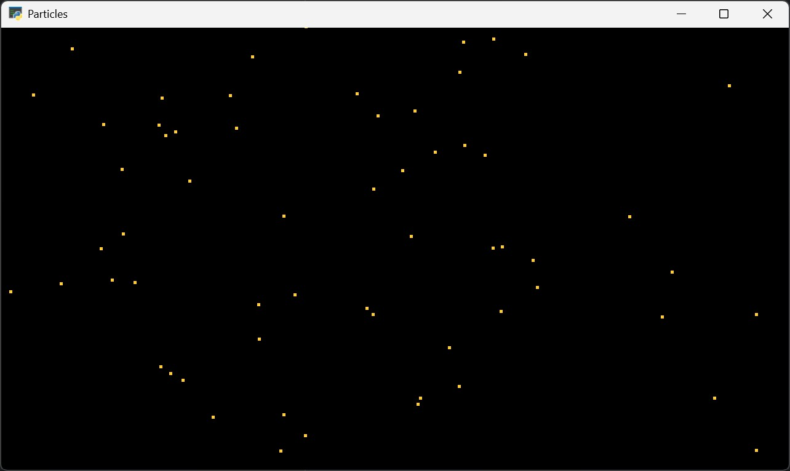
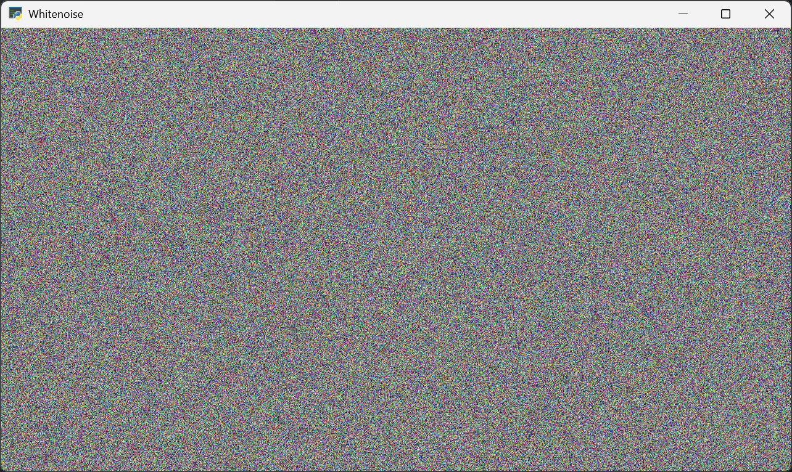

# Examples
All these examples use `moderngl_window` to create a window with an OpenGL context. 

# Particles
A system of N particles is computed in PyTorch. The particle position is copied to a ModernGL buffer and
rendered every frame.

# Whitenoise
We make a random Tensor in PyTorch. This tensor is copied to a ModernGL Texture every frame and rendered to the screen.

